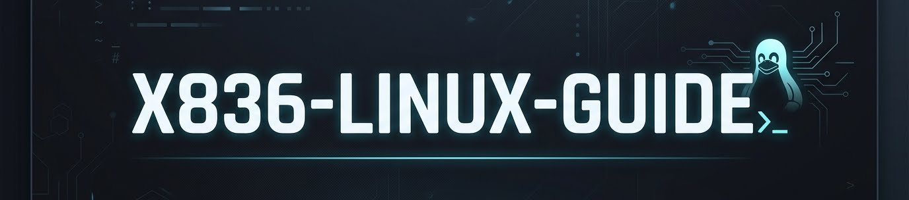
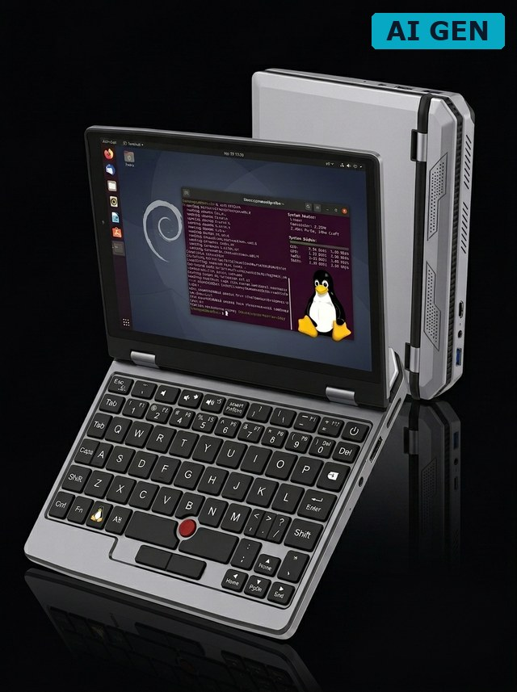

<p align="center">
  
</p>

<h3 align="center">Complete Linux setup guide for the X836 7-inch pocket laptop<br><sub>(AliExpress / Topton / TOPOSH / KAISERINC / Acogedor / Yoidesu / WOPOW / "A7" — same hardware, dozens of stickers)</sub></h3>

<p align="center">
  
  
  
  
  
</p>

<p align="center">
  <a href="#the-story">Story</a> ·
  <a href="#the-device">Device</a> ·
  <a href="#is-this-your-device">Is this yours?</a> ·
  <a href="#quickstart">Quickstart</a> ·
  <a href="#what-works--what-doesnt">Status</a> ·
  <a href="#the-fixes">Fixes</a> ·
  <a href="#hardware-deep-dive">Deep-Dive</a> ·
  <a href="#troubleshooting">Troubleshooting</a> ·
  <a href="#references">Refs</a>
</p>

---

## The story

This laptop has no real name. It's sold as **Topton**, **TOPOSH**, **KAISERINC**, **Acogedor**, **Yoidesu**, **A7**, **WOPOW** — and a dozen more. Different stickers, same hardware. The BIOS says "Default string" for vendor, product, and manufacturer. Nobody knows who actually makes it.

By dumping the ACPI tables and analyzing the BIOS, we discovered this is actually an **Intel tablet/convertible reference design** (board code `X836`) related to the **Chuwi LapBook** family. The board was originally designed for a full-featured tablet with GPS (Broadcom BCM4752), NFC (NXP NPC100), fingerprint reader (FS4304), LTE modem, and USB-C — but the Chinese manufacturers cheaped out and only populated the basics: screen, keyboard, touchpad, WiFi, webcam.

The ACPI tables still define all these ghost devices. When you scan the I2C buses or read the DSDT, you find the digital ghosts of a device that could have been much more.

Some units ship with **Intel 7265 WiFi** (broken under Linux due to a PCI D3cold power state bug), others with **Realtek RTL8821CE** (works). There's no way to tell which you'll get until you open it. The BIOS has hidden Advanced settings locked behind AMI Aptio V — no keyboard shortcut unlocks them, but we dumped the BIOS chip and it's ready for RE.

Despite all this, with the right fixes, it makes a surprisingly good little Linux touch tablet. This guide documents everything we learned getting it there — every fix, every failure, every dead end.

> **Reference:** Dave Minter documented the [same device on paperstack.com](https://paperstack.com/palmtop/) running Ubuntu 24.04.

## The device

<p align="center">
  
  <br>
  <sub><i>AI-rendered preview (echte Geräte-Fotos willkommen — PR welcome)</i></sub>
</p>

| | |
|---|---|
| **Board** | X836 (OEM, Intel reference design, Chuwi LapBook family) |
| **CPU** | Intel Celeron J4105 @ 1.50 GHz (Gemini Lake) |
| **RAM** | 8/12 GB LPDDR4 |
| **Storage** | 128GB – 1TB SSD (ShiJi) |
| **Display** | 7" 800×1280 IPS Touch (Portrait, DSI-1) |
| **Touch** | Goodix Capacitive (I2C, GDIX1002) |
| **TrackPoint** | HTIX5288 (Hantick, I2C) |
| **Audio** | Everest ES8316/ES8336 (I2C + Intel SOF) |
| **WiFi** | Intel 7265 **or** Realtek RTL8821CE (varies!) |
| **Bluetooth** | Intel (USB) |
| **Webcam** | Sunplus SPCA2281 |
| **Battery** | 22.2 Wh |
| **Weight** | ~620 g |
| **BIOS** | AMI Aptio V (`X836_A_A25_...Intel3D_LM084`) |

### Is this your device?

The same 7-inch clamshell body has been sold under **dozens of brand names** (Topton, TOPOSH, KAISERINC, GTZS, WOPOW, Acogedor, Yoidesu, A7 …) across **at least three hardware revisions** since 2021. They share quirks (ES8336 audio, Goodix GDIX1002 touchscreen, 22.2 Wh battery, keyboard-scancode mouse buttons) but differ on CPU, display, and WiFi. **This guide targets the X836 / J4105 portrait-panel revision.**

| Feature | Rev A — **GTZS X133** (Jun 2021)¹ | Rev B — **L4 J4125** (Sep 2022)² | Rev C — **X836** (this guide) |
|---|---|---|---|
| CPU | Celeron J3455 (Apollo Lake) | Celeron J4125 (Gemini Lake R) | Celeron **J4105** (Gemini Lake) |
| RAM | 8 GB | 8 GB | 8 / 12 GB LPDDR4 |
| Display | 1024×600 **landscape** LVDS | 1024×600 **landscape** | 800×1280 **portrait** DSI-1 |
| Battery | 22.2 Wh | 3000 mAh (~22 Wh) | 22.2 Wh |
| Audio codec | ES8336 | ES8336 | ES8316 / ES8336 |
| Touchscreen | Goodix GDIX1002 | Goodix | Goodix GDIX1002 |
| WiFi | Realtek RTL8821CU | WiFi 5 | Intel 7265 **or** RTL8821CE |
| HDMI | mini-HDMI | mini-HDMI | **none** |
| Pen | 2048 pressure | 2048 pressure | no |
| Launch price | ~$300 | ~$300 | OEM, varies |

¹ vitor.io — [*"Notes on the GTZS Pocket Book 7-X133 WOPOW 7-inch mini laptop"*](http://vitor.io/notes-7-inch-mini-laptop) (2021-12)
² liliputing.com — [*"This 7 inch mini-laptop with a Celeron J4125 processor sells about for $300 and up"*](https://liliputing.com/this-7-inch-mini-laptop-with-a-celeron-j4125-processor-sells-about-for-300-and-up/) (2022-09)

**30-second Linux check — is yours Rev C?**

```bash
sudo dmidecode -s baseboard-product-name   # expect: X836
grep "model name" /proc/cpuinfo | head -1  # expect: Celeron J4105
ls /sys/class/drm/ | grep DSI              # expect: card*-DSI-1 (portrait panel)
awk '/energy_full_design/{print $1/1e6" Wh"}' /sys/class/power_supply/BAT*/uevent 2>/dev/null
                                            # expect: ~22.2 Wh
```

If CPU/board differ → Rev A or B → see vitor.io for J3455 or the Liliputing J4125 writeup. Fixes in this guide still mostly apply (audio/touch/pointer quirks are shared), but display rotation and WiFi parts won't.

## Quickstart

```bash
# This guide assumes you have SSH access to the device.
# See docs/installation.md for full Debian install instructions.

# 1. Clone this repo on the laptop
git clone https://github.com/YOUR_USER/x836-linux-guide.git
cd x836-linux-guide

# 2. Run the setup
sudo ./setup.sh
```

## What works / what doesn't

<table>
<tr><th>Feature</th><th>Status</th><th>Notes</th></tr>
<tr><td>Touchscreen</td><td>✅</td><td>Works out of the box</td></tr>
<tr><td>Display Rotation</td><td>✅</td><td>Autostart script needed (see Fixes)</td></tr>
<tr><td>Audio (Speaker)</td><td>✅</td><td>Needs mixer fix at boot (systemd service)</td></tr>
<tr><td>TrackPoint</td><td>✅</td><td>Needs button remap + virtual mouse</td></tr>
<tr><td>Webcam</td><td>✅</td><td>Works out of the box</td></tr>
<tr><td>Bluetooth</td><td>✅</td><td>Works out of the box</td></tr>
<tr><td>Lid Switch</td><td>✅</td><td>Screen off/on via <code>busctl</code></td></tr>
<tr><td>USB WiFi</td><td>✅</td><td>RTL8812BU via <code>rtl88x2bu</code> driver</td></tr>
<tr><td>Keyboard</td><td>✅</td><td>Works out of the box</td></tr>
<tr><td>Internal WiFi (Intel 7265)</td><td>❌</td><td>D3cold PCI bug. BIOS-level fix needed. Swap to AX210 may fix.</td></tr>
<tr><td>Internal WiFi (RTL8821CE)</td><td>⚠️</td><td>Some units have this instead — works under Ubuntu 24.04</td></tr>
<tr><td>HDMI Audio</td><td>❌</td><td>IPC pipeline mismatch</td></tr>
<tr><td>Rotation via <code>phoc.ini</code></td><td>❌</td><td><code>transform</code> ignored, autostart script needed</td></tr>
</table>

## The fixes

### Display rotation

The display is a portrait panel (800×1280) mounted landscape. Phosh doesn't persist rotation settings, so we use an autostart script:

```bash
# /usr/local/bin/fix-rotation.sh
python3 -c "
import dbus
bus = dbus.SessionBus()
proxy = bus.get_object('org.gnome.Mutter.DisplayConfig', '/org/gnome/Mutter/DisplayConfig')
iface = dbus.Interface(proxy, 'org.gnome.Mutter.DisplayConfig')
serial, monitors, logical, props = iface.GetCurrentState()
mode_id = str(monitors[0][1][0][0])
monitors_config = dbus.Array([
    dbus.Struct([
        dbus.Int32(0), dbus.Int32(0), dbus.Double(1.25),
        dbus.UInt32(3), dbus.Boolean(True),
        dbus.Array([
            dbus.Struct([
                dbus.String('DSI-1'), dbus.String(mode_id),
                dbus.Dictionary({}, signature='sv'),
            ], signature='ssa{sv}')
        ], signature='a(ssa{sv})')
    ], signature='(iiduba(ssa{sv}))')
], signature='a(iiduba(ssa{sv}))')
iface.ApplyMonitorsConfig(serial, dbus.UInt32(2), monitors_config, dbus.Dictionary({}, signature='sv'))
"
```

> **Note:** `phoc.ini` `transform` setting is ignored by this Phosh version. The DBus API is the only way.

### Audio

The ES8336 codec works with Intel SOF but needs correct ALSA mixer settings at boot:

```bash
# /usr/local/bin/fix-audio.sh
amixer -c 0 cset name='Speaker Switch' on
amixer -c 0 cset name='Headphone Switch' on
amixer -c 0 cset name='Headphone Playback Volume' 3,3
amixer -c 0 cset name='Right Headphone Mixer Right DAC Switch' on
amixer -c 0 cset name='Left Headphone Mixer Left DAC Switch' on
amixer -c 0 cset name='DAC Playback Volume' 192,192
amixer -c 0 cset name='Headphone Mixer Volume' 11,11
```

> **Important:** Use `amixer cset` not `amixer sset` — PipeWire grabs the device and `sset` can't find controls.

### TrackPoint mouse buttons

The mouse buttons send keyboard scancodes instead of mouse events:

- Left button: `KEY_KP5` (scancode `0x4C`)
- Right button: `KEY_COMPOSE` (scancode `0xDD`)

Fix requires two steps:

1. **udev hwdb** remaps scancodes to `BTN_LEFT`/`BTN_RIGHT`
2. **Virtual mouse** (`python3-evdev`) forwards button events from keyboard device to a virtual mouse device — Wayland ignores `BTN` events from keyboard devices

See [`scripts/mouse-button-fix.py`](scripts/mouse-button-fix.py) for the full solution including TrackPoint speed capping (`MAX_SPEED=5`, `DAMPING=0.6`).

### Lid switch

Screen off/on via Mutter DBus API (the only method that works without killing the Phosh session):

```bash
# Screen OFF
busctl --user set-property org.gnome.Mutter.DisplayConfig \
  /org/gnome/Mutter/DisplayConfig \
  org.gnome.Mutter.DisplayConfig PowerSaveMode i 3

# Screen ON
busctl --user set-property org.gnome.Mutter.DisplayConfig \
  /org/gnome/Mutter/DisplayConfig \
  org.gnome.Mutter.DisplayConfig PowerSaveMode i 0
```

Wired up via `acpid` — see [`scripts/lid.sh`](scripts/lid.sh). When lid is closed, the script also:

- Switches CPU governor to `powersave` (800 MHz)
- Disables Bluetooth

When lid is opened, everything is restored to `performance` mode.

> ⚠️ Do NOT use `wlr-randr --off` — it removes the output from the compositor and kills the session.
> ⚠️ Do NOT use `HandleLidSwitch=lock` — it shows a lock screen and may cause black screen after unlock.
> ⚠️ Do NOT use `echo 0 > brightness` — only dims, screen still glows.

### Boot speed

Default Debian 12 boot: **~2 minutes**. After optimization: **~27 seconds**.

| Optimization | Time saved |
|---|---|
| Mask `networking.service` | 60 s |
| Mask `plymouth-quit-wait` | 20 s |
| Mask `NetworkManager-wait-online` | variable |
| Blacklist `iwlwifi` | 10 s |
| `GRUB_TIMEOUT=0` + `GRUB_TIMEOUT_STYLE=hidden` | 2 s |
| `GRUB_DISABLE_OS_PROBER=true` | prevents 30 s os-prober menu |
| `GRUB_RECORDFAIL_TIMEOUT=0` | prevents 30 s recordfail wait |
| `chmod -x /etc/grub.d/30_os-prober` | belt and suspenders |

## Hardware deep-dive

The X836 board is based on an Intel tablet/convertible reference design. The ACPI tables define many devices that are **not physically populated**:

| Defined in ACPI | Chip | Actually present? |
|---|---|---|
| GPS | BCM4752 | No |
| NFC | NXP NPC100 | No |
| Fingerprint | FS4304 | No |
| LTE modem | unknown | No |
| USB Type-C | USBC000 | No |
| Thermistors (SEN1–3) | INT3403 | BIOS disabled |
| Skin thermistor (SEN4) | INT3403 | **Yes** |

The board has **215 GPIO lines**, 13 I²C buses, 3 SPI buses, and 4 UARTs — most unused. A BIOS dump is available for RE work (see `docs/bios-re.md`).

## Troubleshooting

<details>
<summary><b>Internal WiFi (Intel 7265) fails to probe</b></summary>

<br>

Does NOT work under Linux on this board. The card cannot wake from D3cold power state:

```
iwlwifi 0000:02:00.0: HW_REV=0xFFFFFFFF, PCI issues?
iwlwifi: probe failed with error -5
```

**Tested and failed:** `pcie_aspm=off`, `acpi_osi=Windows`, kernel 6.1/6.12, PCI remove+rescan, `setpci` ASPM disable, suspend/wake trick.

**Root cause:** BIOS/ACPI does not properly initialize the PCIe slot. Fix requires BIOS-level modification via [`setup_var.efi`](https://github.com/datasone/setup_var.efi) (hidden BIOS settings).

**Workaround:** USB WiFi adapter (RTL8812BU recommended).

> Some units ship with Realtek RTL8821CE instead of Intel 7265. The Realtek card has the same D3cold issue on this board.

</details>

<details>
<summary><b>Audio silent after login</b></summary>

<br>

Mixer gets reset on session start. Ensure the systemd service calling `fix-audio.sh` runs **after** PipeWire is ready and uses `amixer cset` (not `sset`). See [The Fixes → Audio](#audio).

</details>

<details>
<summary><b>Screen upside-down after boot</b></summary>

<br>

`phoc.ini` `transform` is ignored on this Phosh build. Use the DBus autostart script in [The Fixes → Display rotation](#display-rotation).

</details>

## Detailed guides

- [`docs/device-profile.md`](docs/device-profile.md) — full hardware profile
- _installation / display / audio / trackpoint / wifi / lid-switch / boot-speed_ — WIP (structured write-up coming)

## Related

**Same product family, different revisions:**
- [vitor.io — GTZS Pocket Book 7-X133 WOPOW](http://vitor.io/notes-7-inch-mini-laptop) — Rev A (J3455) Ubuntu 21.10 → 24.10 notes, same ES8336/Goodix/battery
- [paperstack.com/palmtop](https://paperstack.com/palmtop/) — Dave Minter's Ubuntu 24.04 writeup (X836, same as this guide)
- [liliputing.com — Topton L4 (Jun 2021)](https://liliputing.com/topton-l4-is-mini-laptop-with-a-7-inch-display-8gb-of-ram-and-299-starting-price/) — Rev A launch article
- [liliputing.com — J4125 variant (Sep 2022)](https://liliputing.com/this-7-inch-mini-laptop-with-a-celeron-j4125-processor-sells-about-for-300-and-up/) — Rev B
- [linux-hardware.org probes](https://linux-hardware.org/?id=bios:american-megatrends-x836-a-a25-m4u4p0e1c1s3p1a3r1f0w5t6-intel3d-lm084-05-25-2023) — 9 X836 probes

**Upstream fixes & tools:**
- [gnickm/sof-essx8336-debian-fix](https://github.com/gnickm/sof-essx8336-debian-fix) — audio fix reference
- [thesofproject/linux#3336](https://github.com/thesofproject/linux/issues/3336) — ES8336 GLK audio thread
- [ES8336 SOF Wiki](https://github.com/thesofproject/linux/wiki/ES8336-support)
- [`setup_var.efi`](https://github.com/datasone/setup_var.efi) — BIOS variable editor

## References

Found a fix for the internal WiFi? Got audio working differently? Open an issue or PR — this guide grows with every reported unit.

## License

MIT — see [`LICENSE`](LICENSE).

---

<sub>Header + badge palette: `#06b6d4` cyan / `#67e8f9` light cyan / `#0c1929` navy label.</sub>
